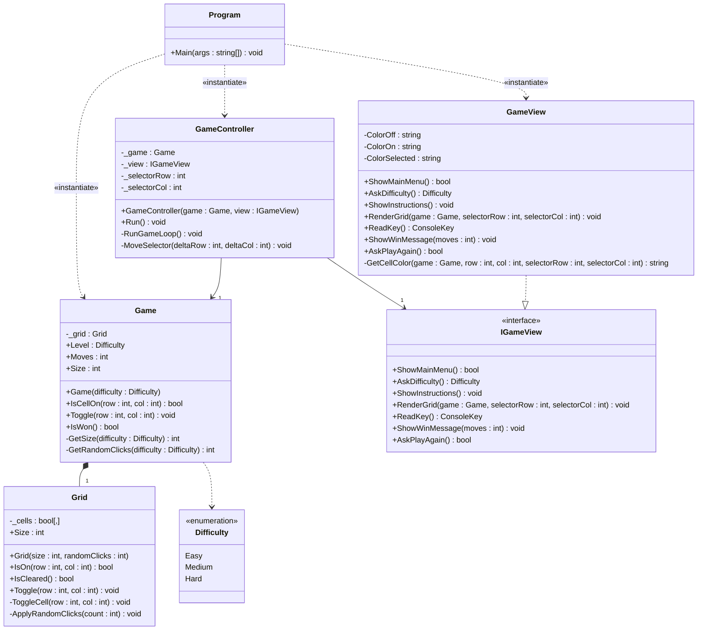

# Blackout

## Authors & Work Division

- _Guilherme Negrinho, a22207383_
  - Designed and implemented the Grid cell toggle and win detection logic;
  - Implemented random grid seeding algorithm;
  - Built the Game session manager (move counter, win condition);
  - Implemented GameController game loop and selector movement with Math.Clamp;
  - Wired up MVC components in Program.cs;
  - Added XML documentation comments across all files.

- _Guilherme Cortez, a22407743_
  - Defined the `IGameView` interface contract
  - Implemented `GameView` using Spectre.Console
  - Designed the colour-coded grid rendering
  - Styled all interactive prompts (main menu, difficulty selection, play again)

---

## Repository

[https://github.com/bread-stealer/Blackout.git](https://github.com/bread-stealer/Blackout.git)

---

## Architecture

### Model

| File | Responsibility |
|------|---------------|
| `Grid.cs` | Stores the 2-D boolean cell array; handles toggle logic and random seeding. |
| `Game.cs` | Owns the `Grid`; exposes move counting, cell state queries, and the win condition. |
| `Difficulty.cs` | Enumeration of the three difficulty levels (Easy, Medium, Hard). |

### View

| File | Responsibility |
|------|---------------|
| `IGameView.cs` | Interface defining the full View contract, allowing alternative UI implementations. |
| `GameView.cs` | Renders the grid with colour-coded cells and reads raw keyboard input. |

### Controller

| File | Responsibility |
|------|---------------|
| `GameController.cs` | Manages the main menu flow, difficulty selection, game loop, selector movement, and win detection. |
| `Program.cs` | Entry point; instantiates MVC components and calls `controller.Run()`. |

### Key Algorithms

#### Grid Initialization

- The board starts with all cells off. A number of random toggles (determined by difficulty) are applied to seed a scrambled but always-solvable starting state, since every toggle operation is its own inverse.

#### Toggle Logic

- Selecting a cell flips that cell and its four orthogonal neighbours (up, down, left, right). Cells at the grid boundary simply skip out-of-bounds neighbours. This is implemented in `Grid.ToggleCell`, which performs a bounds check before flipping.

#### Win Detection

- After every move, `Grid.IsCleared()` iterates all cells; if none are on, the player wins. The check is O(n²) where n is the grid side length, which is negligible for the supported sizes.

#### Selector Movement

- `Math.Clamp` keeps the cursor within grid bounds, removing the need for any manual edge-case checks.

---

## UML Diagram

---

## References & Libraries

- Spectre.Console Team. (2025). *AnsiConsole markup: MarkupLine and Markup* (Version 0.50.0). Spectre.Console. [https://spectreconsole.net/markup](https://spectreconsole.net/markup)

- Spectre.Console Team. (2025). *SelectionPrompt: Interactive selection menus* (Version 0.50.0). Spectre.Console. [https://spectreconsole.net/console/prompts/selection-prompt](https://spectreconsole.net/console/prompts/selection-prompt)

- Spectre.Console Team. (2025). *Confirm and user input prompts* (Version 0.50.0). Spectre.Console. [https://spectreconsole.net/console/how-to/prompting-for-user-input](https://spectreconsole.net/console/how-to/prompting-for-user-input)

- Microsoft. (2025). *Math.Clamp method (System)*. Microsoft Learn. [https://learn.microsoft.com/en-us/dotnet/api/system.math.clamp](https://learn.microsoft.com/en-us/dotnet/api/system.math.clamp)
 
- Microsoft. (2025). *Multidimensional arrays - C# programming guide*. Microsoft Learn. [https://learn.microsoft.com/en-us/dotnet/csharp/programming-guide/arrays/multidimensional-arrays](https://learn.microsoft.com/en-us/dotnet/csharp/programming-guide/arrays/multidimensional-arrays)
 
- Microsoft. (2025). *Interfaces, define behavior for multiple types - C#*. Microsoft Learn. [https://learn.microsoft.com/en-us/dotnet/csharp/fundamentals/types/interfaces](https://learn.microsoft.com/en-us/dotnet/csharp/fundamentals/types/interfaces)