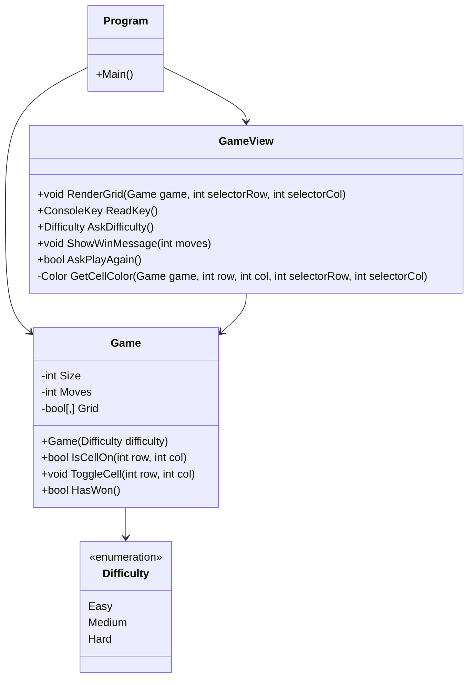

# BLACKOUT
## Authors
**Guilherme Negrinho** 
**Guilherme Cortez**
## Git Repository
https://github.com/bread-stealer/Blackout.git

## UML

## References
- Spectre.Console Documentation - Canvas Widget. (n.d.). https://spectreconsole.net/console/widgets/canvas 
- Pinto, F. (2025). Introdução à Computação- Sintaxe Markdown.